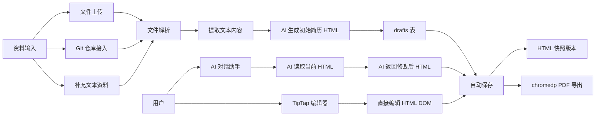
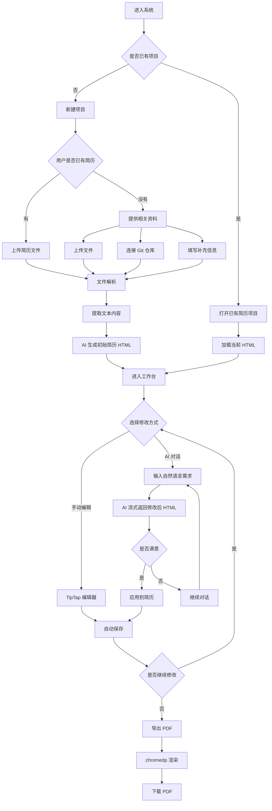
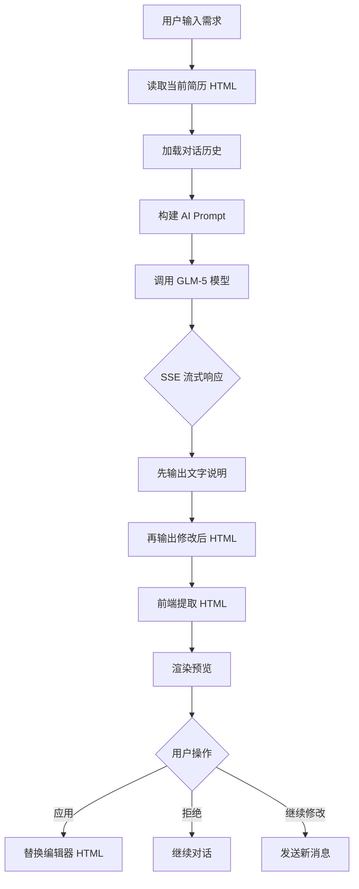

# ResumeGenius 产品功能关系与用户逻辑图

更新时间：2026-04-23

本文档保存当前已经确认的系统关系图与用户流程图，作为后续功能拆分、技术架构和协议设计的基础。

## 1. 功能关系图

## 2. 用户使用逻辑图

## 3. AI 对话内部逻辑图

## 4. 当前已确认的结论

- HTML 是唯一数据源，零中间层
- AI 和 TipTap 编辑器是两条并行的编辑路径
- AI 直接返回修改后的完整 HTML，不经过 Patch 协议
- chromedp 服务端渲染 PDF，用于商业化权限控制
- 版本管理使用 HTML 快照，约 5-10KB 每份
- 部署目标：2C2G 服务器，Docker Compose 一键部署

## 5. 下一步建议

- 基于这些图继续收敛功能边界
- 冻结数据库表结构
- 各模块进入 contract.md 详细设计
