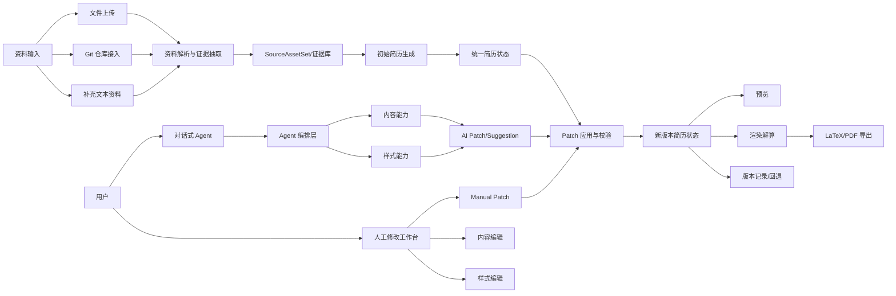
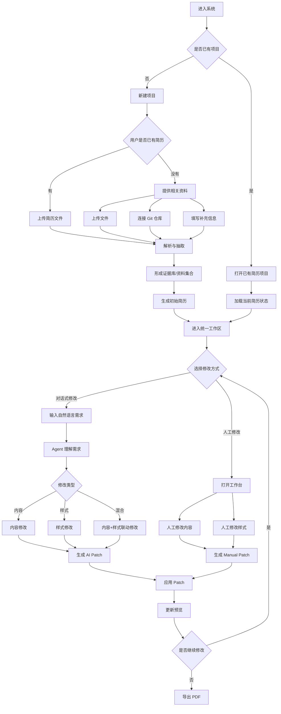
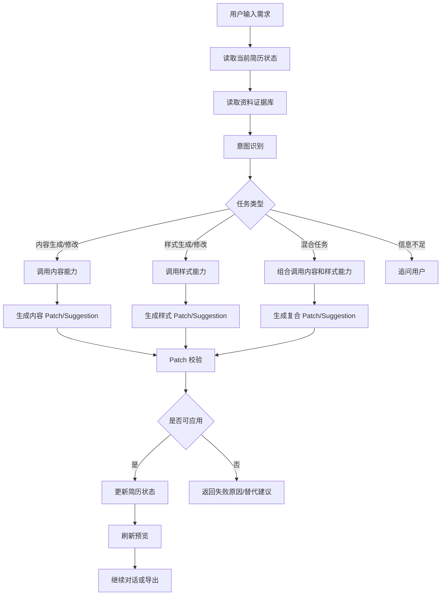
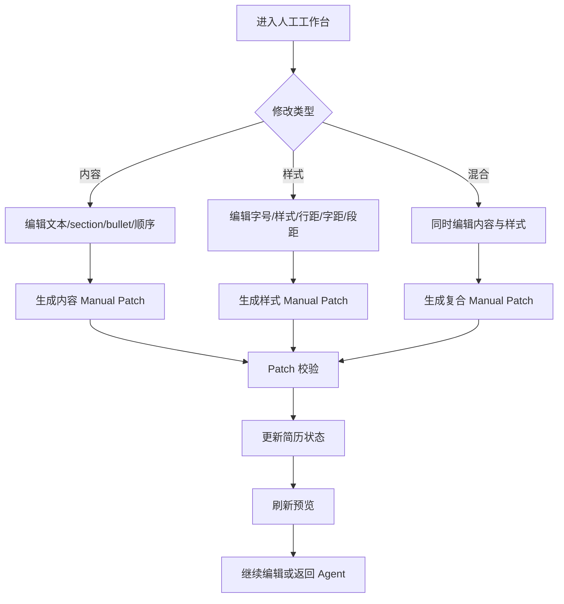

# ResumeGenius 产品功能关系与用户逻辑图

更新时间：2026-04-22

本文档保存当前已经确认的系统关系图与用户流程图，作为后续功能拆分、技术架构和协议设计的基础。

## 1. 功能关系图

## 2. 用户使用逻辑图

## 3. Agent 内部逻辑图

## 4. 人工工作台逻辑图

## 5. 当前已确认的结论

- 项目本质是一个简历编辑 Agent，Agent 是主入口。
- 人工修改工作台是辅助入口，但也同时支持内容和样式修改。
- 用户可以有简历，也可以没有简历。
- 用户输入资料支持文件、Git 仓库和补充文本资料。
- 内容修改与样式修改是能力分类，不是页面分类。
- Agent 和人工工作台最终都应收敛到统一简历状态。
- 统一 Patch 机制是后续协议设计的核心。
- 最终输出链路应统一为预览、渲染解算、PDF 导出。

## 6. 下一步建议

- 基于这些图继续收敛功能边界。
- 定义核心对象模型与 Patch 协议。
- 再做 5 人并行开发的模块划分与实现路径。
